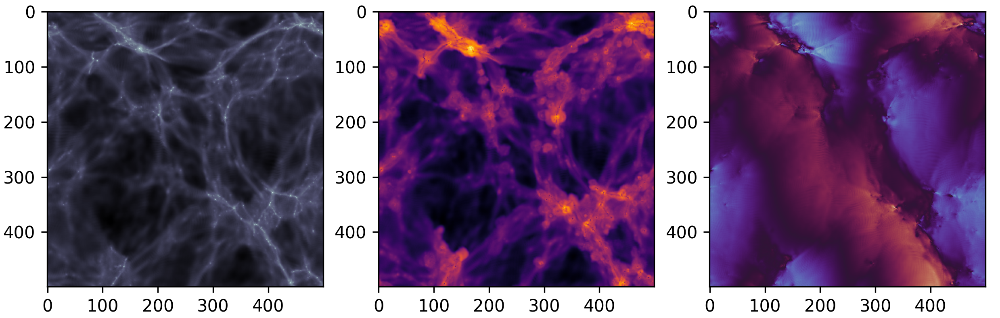
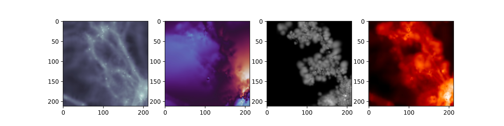
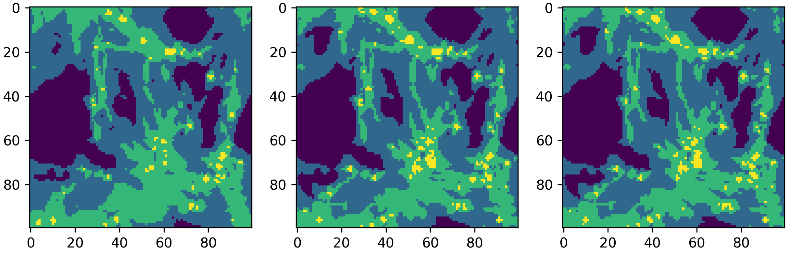

# pgpy
 Particle-grid routines using sph. Illustrative examples can be found in the `documentation` folder.\
 The package offers three key contributions: 
 
 #### Interpolation
 Interpolation of particle fields to arbitrary (2d and 3d) coordinates
 
 
 #### Deposition
 Deposition of particle quantities onto equidistant (2d and 3d) grids using (adaptive) `cic`, `isotropic` and `anisotropic` quintic kernels
 
 
 #### Cosmic web classification
Cosmic web classification using the `T-web` algorithm

