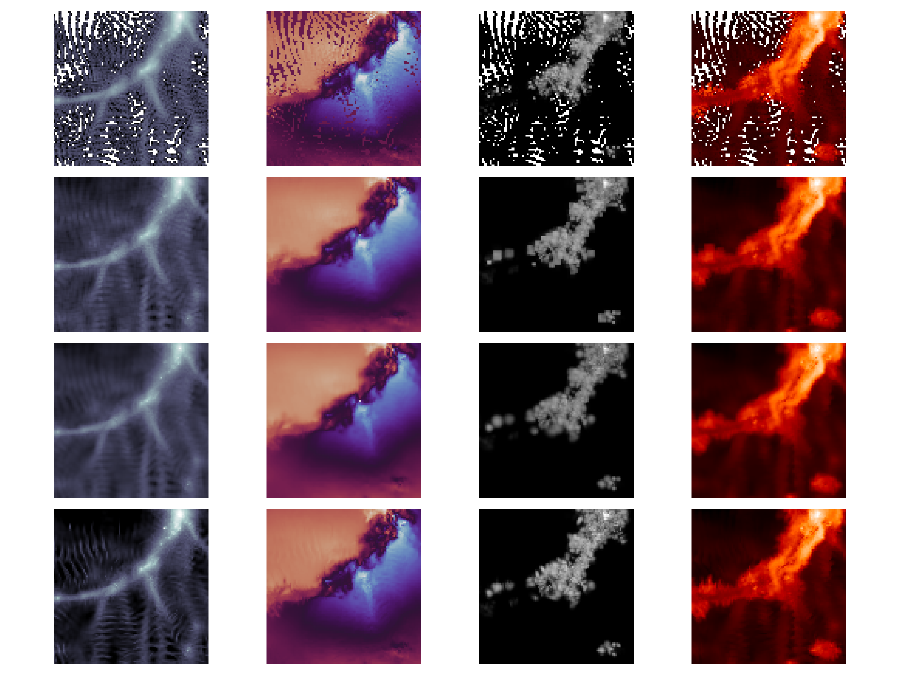

# pgpy
 Particle-grid routines using sph. Illustrative examples can be found in the `documentation` folder.\
 The package offers three key contributions: 
 
 #### Interpolation
 Interpolation of particle fields to arbitrary coordinates
 
 
 #### Deposition
 
 
 #### Cosmic web classification
Cosmic web classification using the T-web algorithm

